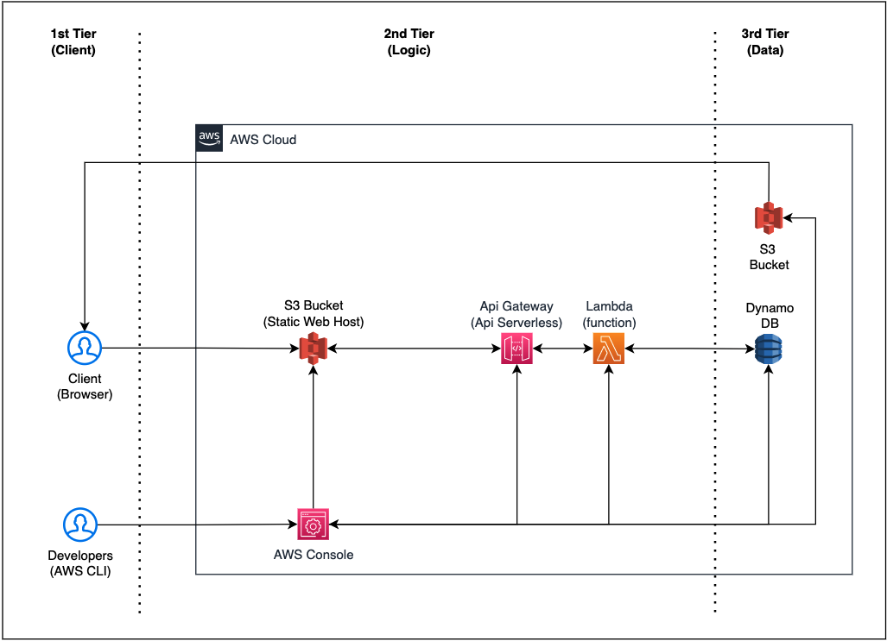

# THREE TIER ARCHITECTURE SERVERLESS



1. This architecture consist of:
- AWS S3
- AWS API GATEWAY
- AWS LAMBDA
- AWS DYNAMODB

## Deploy Architecture
1. Make sure that you already setup aws profile in your local and execute below command to run script that execute sam cli for architecure deployment. Use `--guided` for first time deployment only.

```sh
yarn deploy --guided
```

## Static Website Hosting Setup
1. git clone the repo
```bash
git clone https://github.com/pringtest/demo_web_server.git
cd demo_web_server
```

2. Change `<BUCKET_HOSTING_NAME>` at `package.json`.

3. Copy next.config.example.js to next.config.js and fill all the environment variable
```bash
cp next.config.example.js next.config.js
vim next.config.js
```

4. Build and deploy `NEXTJs` to the S3 bucket hosting.
```bash
yarn build
yarn export
yarn webdeploy
```

## Cleanup

1. To delete the sample application that you created, use the AWS CLI. Assuming you used your project name for the stack name, you can run the following:

```bash
aws cloudformation delete-stack --stack-name sam-app
```